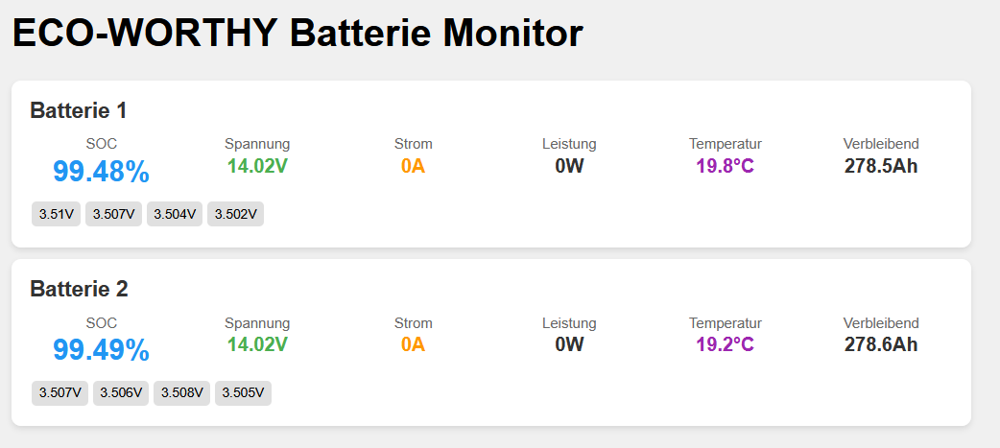

# Eco-Worthy Battery Logger

Ein ESP32-basiertes System zum Überwachen von Eco-Worthy Batterien über Bluetooth Low Energy (BLE) mit MQTT-Integration und Web-Interface.

## Übersicht

Dieses Projekt ermöglicht es, Eco-Worthy Batterien per WLAN zu überwachen, indem es sich über BLE mit den Batterien verbindet, Daten ausliest und diese über MQTT publiziert sowie über ein Web-Interface zur Verfügung stellt.

### Hauptfunktionen

- **Batterie-Monitoring**: Überwachung mehrerer Eco-Worthy Batterien gleichzeitig
- **BLE-Kommunikation**: Drahtlose Verbindung zu den Batterien
- **MQTT-Integration**: Publizierung der Batteriedaten über MQTT
- **Web-Interface**: Lokales Web-Dashboard zur Datenvisualisierung
- **OTA-Updates**: Over-The-Air Firmware-Updates
- **Echtzeit-Daten**: Kontinuierliche Überwachung mit konfigurierbaren Intervallen
- **Status-LEDs**: Visuelle Statusanzeige (optional)
- **Watchdog-Timer**: Systemstabilität und automatische Wiederherstellung




## Hardware-Anforderungen

### Unterstützte Boards
- **M5Stack Stamp S3** (Hauptziel)
- Andere ESP32-S3 basierte Boards

### Hardware-Spezifikationen
- **SoC**: ESP32-S3FN8
- **Flash**: 8MB interner QSPI-Flash
- **RAM**: 512kB SRAM
- **ROM**: 384kB

## Software-Abhängigkeiten

### PlatformIO Libraries
- `knolleary/PubSubClient @ ^2.8` - MQTT Client
- `bblanchon/ArduinoJson @ ^6.21.5` - JSON Verarbeitung
- `fastled/FastLED @ ^3.10.2` - LED-Steuerung

### Entwicklungsumgebung
- **PlatformIO** (empfohlen)
- **Arduino IDE** (alternativ)

## Installation und Setup

### 1. Repository klonen
```bash
git clone <repository-url>
cd eco-worthy-battery-logger
```

### 2. Konfiguration anpassen
Bearbeiten Sie `include/config.h` und passen Sie folgende Einstellungen an:

```cpp
// WiFi Configuration
#define WIFI_SSID "YOUR_WIFI_SSID"
#define WIFI_PASSWORD "YOUR_WIFI_PASSWORD"

// MQTT Configuration
#define MQTT_SERVER "YOUR_MQTT_SERVER_IP"
#define MQTT_PORT 1883
#define MQTT_USER "YOUR_MQTT_USERNAME"
#define MQTT_PASSWORD "YOUR_MQTT_PASSWORD"

// Batterie MAC-Adressen
const String BATTERY_MAC_ADDRESSES[BATTERY_COUNT] = {
...
};
```

### 3. Firmware kompilieren und hochladen

#### Mit PlatformIO
```bash
# Kompilieren
pio run

# Hochladen via USB
pio run --target upload

# Hochladen via OTA (nach erstem Upload)
pio run --target upload --environment m5stack-stamps3-ota
```

#### Mit Arduino IDE
1. Öffnen Sie `src/main.cpp`
2. Installieren Sie die erforderlichen Bibliotheken
3. Wählen Sie "ESP32S3 Dev Module" als Board
4. Kompilieren und hochladen

## Konfiguration

### Batterie-Einstellungen
```cpp
#define BATTERY_COUNT 2                    // Anzahl der Batterien
#define SCAN_INTERVAL_MS 30000            // Scan-Intervall (30 Sekunden)
#define CONNECTION_TIMEOUT_MS 10000       // Verbindungs-Timeout (10 Sekunden)
```

### System-Einstellungen
```cpp
#define LED_ENABLED false                 // LED-Anzeigen aktivieren/deaktivieren
#define WATCHDOG_ENABLED true            // Watchdog-Timer aktivieren
#define WATCHDOG_TIMEOUT_MS 30000        // Watchdog-Timeout (30 Sekunden)
#define OTA_ENABLED true                 // OTA-Updates aktivieren
```

### MQTT-Topics
Das System publiziert Daten unter folgenden Topics:
- `eco-worthy/battery/[MAC]/voltage` - Batteriespannung
- `eco-worthy/battery/[MAC]/current` - Strom
- `eco-worthy/battery/[MAC]/power` - Leistung
- `eco-worthy/battery/[MAC]/capacity` - Kapazität
- `eco-worthy/battery/[MAC]/temperature` - Temperatur
- `eco-worthy/battery/[MAC]/status` - Status

## Web-Interface

Nach dem Start ist das Web-Interface unter der IP-Adresse des ESP32 erreichbar:
```
http://[ESP32-IP-ADRESSE]
```

Das Interface zeigt:
- Aktuelle Batteriewerte
- Verbindungsstatus
- Letzte Aktualisierung
- System-Informationen

## Bedienung

### LED-Statusanzeigen (falls aktiviert)
- **Rot**: WiFi getrennt oder Fehler
- **Gelb**: WiFi-Verbindungsversuch oder MQTT getrennt
- **Blau**: BLE-Verbindung aktiv oder Scanning
- **Grün**: Alles verbunden und funktionsfähig

### Button-Funktionen
- **Kurzer Druck**: Manueller Batterie-Scan

### Serieller Monitor
Verbinden Sie sich mit 115200 Baud für Debug-Ausgaben:
```bash
pio device monitor
```

## OTA-Updates

Nach dem ersten Upload können Updates drahtlos durchgeführt werden:

1. Stellen Sie sicher, dass das Gerät im gleichen Netzwerk ist
2. Verwenden Sie das OTA-Environment:
```bash
pio run --target upload --environment m5stack-stamps3-ota
```

## Fehlerbehebung

### Häufige Probleme

#### WiFi-Verbindung schlägt fehl
- Überprüfen Sie SSID und Passwort in `config.h`
- Stellen Sie sicher, dass das 2.4GHz-Band aktiviert ist
- Prüfen Sie die Signalstärke

#### BLE-Verbindung funktioniert nicht
- Überprüfen Sie die MAC-Adressen der Batterien
- Stellen Sie sicher, dass die Batterien eingeschaltet sind
- Reduzieren Sie die Entfernung zwischen ESP32 und Batterien

#### MQTT-Verbindung schlägt fehl
- Überprüfen Sie Server-IP und Port
- Validieren Sie Benutzername und Passwort
- Prüfen Sie Firewall-Einstellungen

#### System hängt sich auf
- Watchdog-Timer ist standardmäßig aktiviert (30s Timeout)
- Überprüfen Sie die serielle Ausgabe für Fehlermeldungen
- Reduzieren Sie `MANAGER_TIMEOUT_MS` bei langsamen Netzwerken

## Protokoll-Details

### BLE-Kommunikation
- **Service UUID**: `0000ff00-0000-1000-8000-00805f9b34fb`
- **Write Characteristic**: `0000ff02-0000-1000-8000-00805f9b34fb`
- **Read Characteristic**: `0000ff01-0000-1000-8000-00805f9b34fb`

### Unterstützte Kommandos
- `0x03`: Basis-Informationen lesen
- `0x04`: Zellspannungen lesen
- `0x05`: Hardware-Version lesen

### Frame-Struktur
```
[START] [TYPE] [LENGTH] [COMMAND] [DATA] [CHECKSUM] [END]
  0xDD   0xA5     XX      0x03     ...      XX      0x77
```

## Danksagungen

Dieses Projekt basiert in Teilen auf der Kommunikationslogik von [mike805/eco-worthy-battery-logger](https://github.com/mike805/eco-worthy-battery-logger). Vielen Dank an mike805 für die Bereitstellung dieser Informationen.

---

**Hinweis**: Dieses Projekt ist nicht offiziell von Eco-Worthy unterstützt oder gesponsert.
